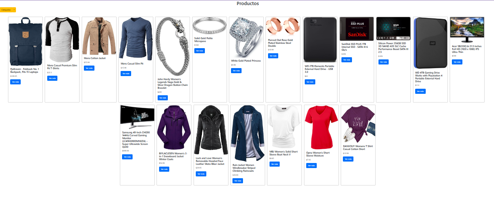

# fetchProductos
En este repositorio se encuentra un proyecto que fue realizado utilizando diferentes teconologías **(HTML, CSS y JavaScript)**.  
Dentro de **JavaScript**, se utilizó la función fetch para mandar a traer productos desde una API (_"Fake Store API"_).
También se utilizó **Bootstrap** como framework para obtener los modales y las cards. 

##English 
This repository contains a project that was built using different technologies **(HTML, CSS, and JavaScript)**.   Within **JavaScript**, the fetch function was used to retrieve products from an API (_"Fake Store API"_). Bootstrap was also used as a framework to implement modals and cards.

